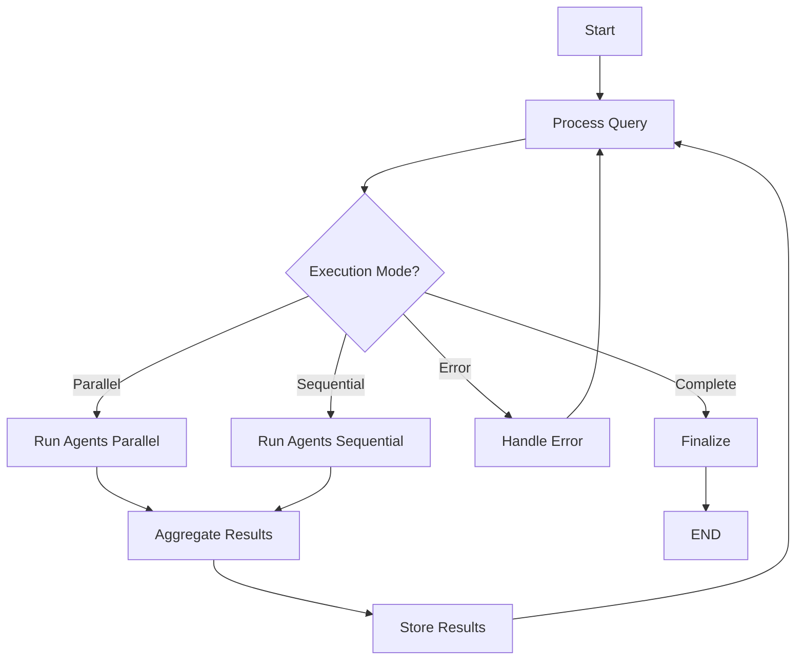

# DataTobiz Brand Monitoring System

A professional, enterprise-grade multi-agent system for monitoring brand mentions across different LLMs using LangGraph orchestration. This system is designed as a scalable solution that demonstrates advanced AI/ML engineering practices.

## 🚀 Project Overview

This system monitors brand mentions across multiple LLM providers (OpenAI GPT and Perplexity) with real-time web search capabilities. Built with LangGraph for sophisticated multi-agent orchestration, it provides enterprise-level reliability, monitoring, and scalability.

### Key Features

- **🤖 Multi-Agent Architecture**: Parallel/sequential execution of multiple LLM agents
- **🕸️ Web-Enhanced Search**: Perplexity integration for real-time web search
- **📊 Automated Data Storage**: Google Sheets integration with structured logging
- **🔄 LangGraph Orchestration**: State-driven workflow management with error handling
- **📈 Performance Monitoring**: Comprehensive metrics and execution tracking
- **🛡️ Production-Ready**: Robust error handling, retries, and fault tolerance
- **🔧 Extensible Design**: Ready for Stage 2 enhancements (ranking detection, analytics)

## 🏗️ Architecture Overview

### System Components

```
DataTobiz Brand Monitoring System
├── 🧠 LangGraph Workflow Engine
│   ├── State Management (Typed Pydantic models)
│   ├── Node Orchestration (Start → Process → Execute → Store → Finalize)
│   └── Conditional Routing (Error handling, mode selection)
├── 🤖 Multi-Agent System
│   ├── OpenAI Agent (GPT-4/3.5 with structured prompts)
│   ├── Perplexity Agent (Web search-enhanced responses)
│   └── Base Agent Framework (Extensible for new LLMs)
├── 🔍 Brand Detection Engine
│   ├── Advanced Pattern Matching (Variations, case-insensitive)
│   ├── Context Analysis (Confidence scoring, sentiment)
│   └── Ranking Detection (Stage 2 preparation)
├── 📊 Storage & Analytics
│   ├── Google Sheets Integration (Real-time data storage)
│   ├── Historical Analysis (Performance tracking)
│   └── Export Capabilities (JSON, CSV formats)
└── ⚙️ Configuration Management
    ├── Environment Variables (API keys, secrets)
    ├── YAML Configuration (Workflow settings)
    └── Runtime Settings (Performance tuning)
```

### LangGraph Workflow Design



## 📋 Setup Instructions

### Prerequisites

- Python 3.8+
- OpenAI API key
- Perplexity API key
- Google Cloud Project with Sheets API enabled
- Git

### 1. Installation

```bash
# Clone the repository
git clone <repository-url>
cd datatobiz-brand-monitoring

# Create virtual environment
python -m venv venv

# Activate virtual environment
# On Windows:
venv\Scripts\activate
# On Mac/Linux:
source venv/bin/activate

# Install dependencies
pip install -r requirements.txt
```

### 2. API Keys Setup

#### OpenAI API Key
1. Visit [OpenAI Platform](https://platform.openai.com/api-keys)
2. Create new API key
3. Copy the key for configuration

#### Perplexity API Key
1. Visit [Perplexity Settings](https://www.perplexity.ai/settings/api)
2. Generate API key
3. Copy the key for configuration

#### Google Sheets Setup
1. Go to [Google Cloud Console](https://console.cloud.google.com/)
2. Create new project or select existing
3. Enable Google Sheets API
4. Create Service Account:
   - Go to IAM & Admin > Service Accounts
   - Click "Create Service Account"
   - Download JSON credentials file
5. Create Google Spreadsheet:
   - Open Google Sheets
   - Create new spreadsheet
   - Share with service account email (from JSON file)
   - Copy spreadsheet ID from URL

### 3. Configuration

#### Environment Variables
```bash
# Copy template and edit
cp .env.template .env

# Edit .env file with your API keys
OPENAI_API_KEY=your_openai_api_key_here
PERPLEXITY_API_KEY=your_perplexity_api_key_here
GOOGLE_SPREADSHEET_ID=your_google_spreadsheet_id_here
```

#### Google Credentials
```bash
# Place your Google service account JSON file
cp /path/to/your/credentials.json ./credentials.json
```

#### Configuration File
```bash
# Edit config.yaml
# Update spreadsheet_id, model preferences, etc.
vim config.yaml
```

### 4. Testing Installation

```bash
# Run the comprehensive test suite
python test_sample.py

# Or run unit tests
python -m pytest tests/ -v

# Or test connections only
python main.py --test-connections
```

## 🚀 Usage

### Command Line Interface

```bash
# Basic usage with sample queries
python main.py

# Custom queries
python main.py --query "best data analytics companies" "top BI tools"

# Sequential processing
python main.py --query "analytics platforms" --mode sequential

# Detailed output
python main.py --query "data visualization tools" --output detailed

# JSON output for automation
python main.py --query "business intelligence" --output json

# Test all connections
python main.py --test-connections

# View historical statistics
python main.py --stats --days-back 30
```

### Programmatic API

```python
import asyncio
from main import BrandMonitoringAPI

async def monitor_brand():
    # Initialize the API
    api = BrandMonitoringAPI("config.yaml")
    
    try:
        # Initialize system
        await api.initialize()
        
        # Monitor queries
        result = await api.monitor_queries([
            "best data analytics companies",
            "top business intelligence tools"
        ])
        
        if result['success']:
            print(f"Brand mentions found: {result['summary']['brand_mentions_found']}")
            
            for query, data in result['results'].items():
                if data['found']:
                    print(f"✅ Found in: {query}")
                    print(f"   Confidence: {data['confidence']:.1%}")
        
    finally:
        await api.cleanup()

# Run the monitoring
asyncio.run(monitor_brand())
```

### Advanced Configuration

```python
# Custom workflow with specific agents
from src.workflow.graph import create_workflow
from src.config.settings import get_settings

async def custom_monitoring():
    # Load and modify settings
    settings = get_settings()
    settings.workflow.processing_mode = "sequential"
    settings.workflow.max_retries = 5
    
    # Create workflow
    workflow = await create_workflow(settings)
    
    # Execute with custom parameters
    queries = ["enterprise analytics platforms"]
    result = await workflow.execute_workflow(queries, "parallel")
    
    # Access detailed results
    for query, query_state in result.query_states.items():
        print(f"Query: {query}")
        print(f"Found: {query_state.overall_found}")
        print(f"Confidence: {query_state.consensus_confidence}")
        
        for agent_name, agent_result in query_state.agent_results.items():
            print(f"  {agent_name}: {agent_result.status}")
```

## 📊 Output Examples

### Summary Format
```
=============================================================
DATATOBIZ BRAND MONITORING RESULTS
=============================================================
Total Queries Processed: 3
Successful Executions: 3
Brand Mentions Found: 1
Success Rate: 100.0%

Query Results:
----------------------------------------
best data analytics companies            ✓ FOUND (85%)
top business intelligence tools          ✗ NOT FOUND
leading data visualization software      ✗ NOT FOUND

Agent Performance:
----------------------------------------
openai          Success: 100.0%, Avg Time: 2.34s
perplexity      Success: 100.0%, Avg Time: 3.12s
=============================================================
```

### JSON Format
```json
{
  "success": true,
  "workflow_id": "uuid-string",
  "summary": {
    "total_queries": 3,
    "processed": 3,
    "brand_mentions_found": 1,
    "success_rate": 1.0
  },
  "results": {
    "best data analytics companies": {
      "found": true,
      "confidence": 0.85,
      "ranking": null,
      "agents": {
        "openai": {
          "status": "completed",
          "execution_time": 2.34,
          "found": true,
          "confidence": 0.82
        },
        "perplexity": {
          "status": "completed", 
          "execution_time": 3.12,
          "found": true,
          "confidence": 0.88
        }
      }
    }
  }
}
```

## 🧪 Testing

### Running Tests

```bash
# Run all tests
python -m pytest tests/ -v

# Run specific test category
python -m pytest tests/test_agents.py -v

# Run integration tests (requires API keys)
python -m pytest tests/ -v -m integration

# Run with coverage
python -m pytest tests/ --cov=src --cov-report=html
```

### Sample Test Queries

The system includes predefined test queries that work well for testing:

```python
SAMPLE_QUERIES = [
    "best data analytics companies 2024",
    "top business intelligence tools",
    "leading data visualization software",
    "enterprise analytics platforms",
    "data science consulting firms"
]
```

## 🔧 Configuration Reference

### config.yaml Structure

```yaml
# Core Configuration
google_sheets:
  spreadsheet_id: "your_spreadsheet_id"
  worksheet_name: "Brand_Monitoring"
  credentials_file: "credentials.json"

# Brand Detection
brand:
  target_brand: "DataTobiz"
  brand_variations: ["DataTobiz", "Data Tobiz", "data tobiz"]
  case_sensitive: false
  partial_match: true

# Workflow Settings
workflow:
  max_retries: 3
  retry_delay: 1.0
  parallel_execution: true
  timeout_per_agent: 60
  log_level: "INFO"

# LLM Configurations
llm_configs:
  openai:
    model: "gpt-4"
    max_tokens: 1000
    temperature: 0.1
  perplexity:
    model: "llama-3.1-sonar-small-128k-online"
    max_tokens: 1000
    temperature: 0.1
```

### Environment Variables

| Variable | Description | Required |
|----------|-------------|----------|
| `OPENAI_API_KEY` | OpenAI API key for GPT models | Yes* |
| `PERPLEXITY_API_KEY` | Perplexity API key for web search | Yes* |
| `GOOGLE_SPREADSHEET_ID` | Google Sheets spreadsheet ID | Yes |
| `LOG_LEVEL` | Logging level (DEBUG, INFO, WARNING, ERROR) | No |
| `DEBUG_MODE` | Enable debug mode (true/false) | No |

*At least one LLM API key is required

## 🎯 Stage 2 Roadmap

The system is architected to easily accommodate Stage 2 enhancements:

### Planned Features

1. **🏆 Ranking Detection**
   - Position detection (1st, 2nd, 3rd, etc.)
   - Context analysis for competitive positioning
   - Ranking trend analysis over time

2. **🔍 Google Gemini Integration**
   - Third LLM agent for consensus validation
   - Specialized prompts for different use cases
   - Multi-modal capabilities preparation

3. **📈 Advanced Analytics**
   - Sentiment analysis around brand mentions
   - Competitor analysis and benchmarking
   - Trend detection and alerting

4. **🔔 Alerting & Notifications**
   - Real-time alerts for brand mentions
   - Threshold-based notifications
   - Integration with Slack, email, webhooks

### Stage 2 Implementation Plan

```python
# Already prepared in current architecture:

# 1. BrandDetectionResult includes ranking fields
class BrandDetectionResult(BaseModel):
    ranking_position: Optional[int] = None  # ✅ Ready
    ranking_context: Optional[str] = None   # ✅ Ready

# 2. Configuration supports ranking detection
enable_ranking_detection: bool = False     # ✅ Ready

# 3. Agent factory supports new agents
AgentFactory.register_agent("gemini", GeminiAgent)  # ✅ Ready

# 4. Storage schema includes Stage 2 columns
stage2_columns = [
    "Ranking_Position", "Ranking_Context",
    "Raw_Response_Length", "Token_Usage"
]  # ✅ Ready
```

## 🔍 Architecture Deep Dive

### LangGraph State Management

The system uses typed Pydantic models for state management, ensuring type safety and data validation throughout the workflow:

```python
class WorkflowState(BaseModel):
    """Main state object flowing through LangGraph"""
    queries: List[str]
    query_states: Dict[str, QueryState]
    current_query_index: int
    # ... comprehensive state tracking
```

### Agent Architecture

All agents inherit from `BaseAgent`, providing:

- **Consistent Interface**: Same execute() method across all agents
- **Retry Logic**: Configurable retry with exponential backoff
- **Performance Tracking**: Built-in metrics collection
- **Health Monitoring**: Connection testing and validation
- **Error Handling**: Comprehensive exception management

### Brand Detection Engine

The brand detection system provides:

- **Multi-variant Matching**: Handles different brand name formats
- **Context Analysis**: Surrounding text analysis for confidence
- **Confidence Scoring**: Weighted scoring based on match quality
- **Future-Ready**: Ranking detection infrastructure in place

### Storage Integration

Google Sheets integration features:

- **Atomic Operations**: Individual result storage
- **Batch Processing**: Efficient bulk operations
- **Schema Evolution**: Ready for Stage 2 columns
- **Error Recovery**: Robust error handling and retries

## 🛡️ Production Considerations

### Security

- **API Key Management**: Environment variable isolation
- **Credential Security**: Service account JSON protection
- **Input Validation**: Query sanitization and validation
- **Rate Limiting**: Built-in API rate limit handling

### Performance

- **Parallel Execution**: Concurrent agent processing
- **Connection Pooling**: Efficient HTTP connection reuse
- **Caching**: Response caching where appropriate
- **Monitoring**: Comprehensive performance metrics

### Reliability

- **Retry Logic**: Configurable retry with backoff
- **Circuit Breakers**: Failure detection and recovery
- **Graceful Degradation**: Continue operation with partial failures
- **Health Checks**: Continuous service monitoring

### Scalability

- **Modular Design**: Easy addition of new agents
- **Configuration-Driven**: Runtime behavior modification
- **State Management**: Efficient memory usage
- **Extension Points**: Plugin architecture for new features

## 🐛 Troubleshooting

### Common Issues

#### API Connection Errors
```bash
# Test individual connections
python main.py --test-connections

# Check API key validity
python -c "import os; print('OpenAI:', bool(os.getenv('OPENAI_API_KEY')))"
```

#### Google Sheets Access
```bash
# Verify credentials file
ls -la credentials.json

# Test spreadsheet access
python -c "import gspread; gc = gspread.service_account('credentials.json'); print('Connected:', bool(gc))"
```

#### Configuration Issues
```bash
# Validate configuration
python -c "from src.config.settings import get_settings; s = get_settings(); print('Errors:', s.validate_configuration())"
```

### Debug Mode

Enable debug logging for detailed troubleshooting:

```bash
# Environment variable
export LOG_LEVEL=DEBUG

# Or modify config.yaml
workflow:
  log_level: "DEBUG"
```

### Log Files

Check log files for detailed error information:

```bash
# View recent logs
tail -f logs/brand_monitoring.log

# Search for errors
grep -i error logs/brand_monitoring.log
```

## 📞 Support & Contributing

### Getting Help

1. **Check Documentation**: Review this README and code docstrings
2. **Run Tests**: Use `test_sample.py` for system validation
3. **Check Logs**: Review log files for detailed error information
4. **Test Connections**: Use `--test-connections` flag

### Contributing

1. **Fork Repository**: Create your feature branch
2. **Follow Standards**: Use existing code style and patterns
3. **Add Tests**: Include comprehensive test coverage
4. **Update Documentation**: Maintain README and docstrings
5. **Submit PR**: Include detailed description of changes

## 📄 License

This project is designed for DataTobiz brand monitoring purposes. Ensure compliance with all API provider terms of service and data privacy regulations.

---

**Built with ❤️ for DataTobiz using modern AI/ML engineering practices**

*This system demonstrates enterprise-level multi-agent architecture, LangGraph orchestration, and production-ready AI application development.*